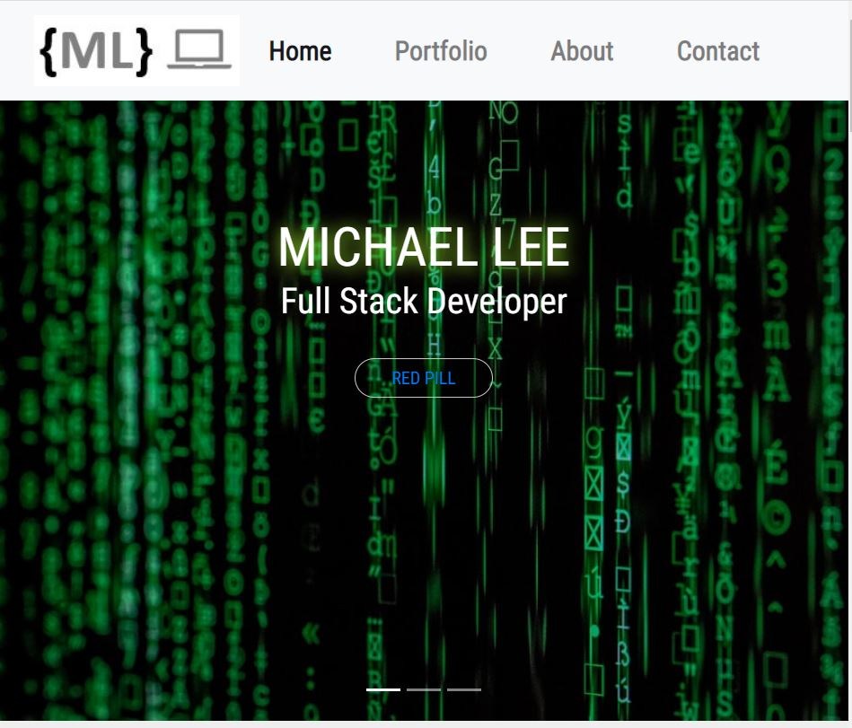

# Portfolio Page: Professional Materials

My goal was to make a simple and aesthetically pleasing website demonstrating what I learn in the Full Stack Coding Bootcamp.  The website consists of 3 sections- Portfolio, About, and Contact with smooth scrolling and animated effects when clicking on projects.  I wrote a brief intro, provide contact info, a link to my pdf resume, and my Linkedin profile.

## 

It's a mobile-first website.  It's updated with my coding portfolio featuring project 1 and 5 homework assignments. The portfolio has 6 animated images with projects titles, screenshots of app, link to github page repository, and deployed versions. The apps are pinned on my Github page along with my updated information such as profile pic, bio, links and email. 

## 
Deployed link: https://mikewclee.github.io/Updated-Portfolio-Page/

https://github.com/mikewclee/Updated-Portfolio-Page

